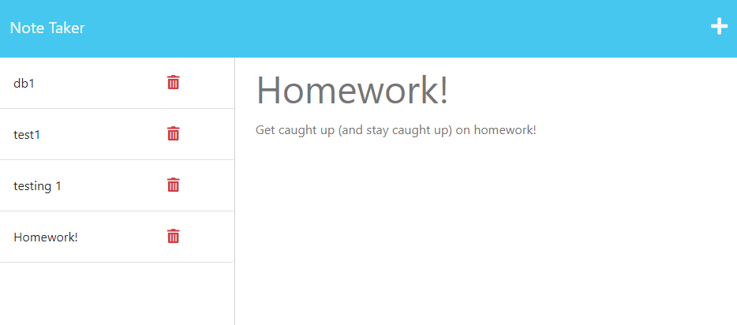

# note-taker

## Description

Uses express.js to save and retrieve notes from a json file

## Usage

Follow deployed link, [heroku](https://note-taker-k001-cf91389e178a.herokuapp.com/notes)

Put in a title and content for the note and click the save button to store it in the lefthand column. Click the delete button to remove task from list.

  

## License

MIT